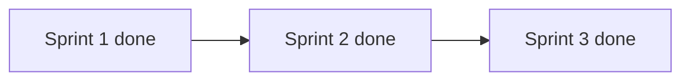

# UX improvement roadmap

План по результатам UX-аудита. **Спринты 1–3** реализованы.

Единый отступ контента от шапки: `var(--content-offset-from-header)` (= `calc(var(--site-header-height) * 2)`), см. `UI_RULES.md` и `src/index.css`.

---

## Спринт 1 — выполнен

| # | Задача | Файлы |
|---|--------|-------|
| 1 | Шапка: a11y и тема (☀/🌙, `aria-label`, `aria-pressed`) | `index.html` |
| 2 | Убрать двойной отступ сверху (`#root` + `PageLayout`) | `index.css`, `index.html`, `PageLayout.tsx` |
| 3 | Публичный калькулятор: заголовок и «← К списку» | `PublicCalculator.tsx`, `main.tsx` |
| 4 | Теги-фильтры как `<button>` | `BlogPage.tsx`, `NotesPage.tsx` |
| 5 | Скелетоны загрузки вместо «Загрузка…» | `PageLoadingFallback.tsx`, `main.tsx` |

---

## Спринт 2 — выполнен (2026-05-26)

| # | Задача | Файлы |
|---|--------|-------|
| 6 | Toast / inline-ошибки | `Toast.tsx`, `toast.ts`, `editor/page.tsx`, `ReviewPanel.tsx`, `SyncSettings.tsx`, `NotesPage.tsx` |
| 7 | «Нет доступа» + CTA «Войти» | `AdminAccessDenied.tsx`, `main.tsx` |
| 8 | Баннер редактора на узком экране | `editor/page.tsx`, `index.css` |
| 9 | Заметки: a11y плитки и меню ⋯ | `NotesPage.tsx`, `index.css` |
| 10 | PWA manifest под тёмную тему | `manifest.json`, `docs/PWA_INDEXING.md` |

---

### 6. Toast и inline-ошибки (выполнено)

**Файлы:** `src/components/Toast.tsx` (новый), `src/app/admin/editor/page.tsx`, `src/app/admin/review/ReviewPanel.tsx`, при необходимости `src/lib/githubSync.ts` / `SyncSettings.tsx`.

**Критерии приёмки:**
- В 3–5 горячих сценариях (ошибка публикации, валидация, сбой sync, удаление с подтверждением) вместо `alert()` / `confirm()` показываются неблокирующие toast или inline-баннер с текстом на русском.
- Toast исчезает через таймаут или по кнопке «Закрыть»; ошибки синхронизации дублируются в `aria-live="polite"`.
- Поведение бизнес-логики (отмена действия, retry) сохранено.

**Оценка:** 4–6 ч.

---

### 7. Страницы «нет доступа» — CTA «Войти» (выполнено)

**Файлы:** `src/components/AdminAccessDenied.tsx`, `src/main.tsx` (блоки «Доступ по входу» для planner/weather/rss).

**Критерии приёмки:**
- На экранах без прав есть явная кнопка/ссылка «Войти» → `/welcome_me`.
- Краткий текст: админ vs гостевой доступ (планировщик, метео).
- При `sessionExpired` приоритет у «Войти снова», без дублирования противоречивых ссылок.

**Оценка:** 2–3 ч.

---

### 8. Редактор: баннер на узком экране (выполнено)

**Файлы:** `src/app/admin/editor/page.tsx`, при необходимости `src/index.css`.

**Критерии приёмки:**
- При `max-width` &lt; 1024px (или согласованном breakpoint) показывается заметный баннер: «Редактор рассчитан на планшет/ПК».
- Редактор по-прежнему доступен (не блокировать), но ожидания пользователя снижены.
- Баннер не перекрывает фиксированную шапку (`--content-offset-from-header`).

**Оценка:** 2 ч.

---

### 9. Заметки: a11y плитки и меню (выполнено)

**Файлы:** `src/app/admin/notes/NotesPage.tsx`, `src/index.css`.

**Критерии приёмки:**
- Превью в grid имеют `aria-label` с заголовком заметки (и датой при необходимости).
- Меню «⋯» на карточке: фокус с клавиатуры, `Escape` закрывает, видимый `:focus-visible`.
- Фильтры по тегам остаются кнопками (спринт 1); не ломается list/grid/split.

**Оценка:** 3–4 ч.

---

### 10. PWA manifest: цвета под тёмную тему (выполнено)

**Файлы:** `public/manifest.json`, при необходимости `index.html` (`theme-color` meta).

**Критерии приёмки:**
- `background_color` и `theme_color` согласованы с дефолтной тёмной темой сайта (без резкого светлого splash при установке PWA).
- Документировано в `docs/PWA_INDEXING.md`, если меняется рекомендация по установке.

**Оценка:** 1 ч.

---

## Спринт 3 — выполнен (2026-05-26)

| # | Задача | Файлы |
|---|--------|-------|
| 11 | Компактное меню в шапке | `SiteHeader.tsx`, `index.html`, `index.css`, `main.tsx` |
| 12 | Поиск в блоге | `BlogPage.tsx` |
| 13 | Заметки: drawer сайдбара на мобильном | `NotesPage.tsx`, `index.css` |
| 14 | Бейдж синхронизации | `SyncBadge.tsx`, `githubSync.ts`, `SyncSettings.tsx`, `SiteHeader.tsx` |
| 15 | Weather / RSS: guided empty state | `SetupWizard.tsx`, `WeatherPage.tsx`, `RssPage.tsx` |

---

### 11. Компактное меню в шапке (выполнено)

**Файлы:** `index.html`, `src/components/SiteHeader.tsx`, `src/index.css`, `src/main.tsx`.

**Критерии приёмки:**
- 4–6 публичных ссылок: главная, калькуляторы, блог, CV (и др. по согласованию).
- Для админа/гостя — условные пункты (заметки, планировщик, метео) без дублирования всего футера.
- Активный раздел визуально выделен; на мобильном — сворачиваемое меню (бургер или drawer).
- `aria-expanded` / `aria-controls` для раскрывающегося меню.

**Оценка:** 6–8 ч.

---

### 12. Поиск в блоге (выполнено)

**Файлы:** `src/app/blog/BlogPage.tsx`.

**Критерии приёмки:**
- Поле поиска по заголовку и тексту поста (как в заметках: `type="search"`).
- Фильтр по тегам работает совместно с поиском.
- Пустое состояние «Ничего не найдено» на русском.

**Оценка:** 3–4 ч.

---

### 13. Заметки на мобильном: drawer сайдбара (выполнено)

**Файлы:** `src/app/admin/notes/NotesPage.tsx`, `src/index.css`.

**Критерии приёмки:**
- На `max-width: 768px` сайдбар не занимает постоянно до 45vh без действия пользователя.
- Кнопка «Папки» / «Поиск» открывает overlay/drawer; закрытие по overlay, кнопке или `Escape`.
- Лента заметок использует освободившуюся высоту экрана.

**Оценка:** 5–6 ч.

---

### 14. Бейдж синхронизации для админа (выполнено)

**Файлы:** `src/components/SyncBadge.tsx`, `src/lib/githubSync.ts`, `src/components/SyncSettings.tsx`, `src/components/SiteHeader.tsx`.

**Критерии приёмки:**
- Один индикатор в шапке: «синхронизировано» / «идёт» / «ошибка» (по последнему pull/push или тесту соединения).
- Клик ведёт к настройкам sync или показывает последнюю ошибку.
- Не дублирует все мелкие статусы по страницам.

**Оценка:** 4–5 ч.

---

### 15. Weather / RSS: guided empty state (выполнено)

**Файлы:** `src/components/SetupWizard.tsx`, `src/app/weather/WeatherPage.tsx`, `src/app/rss/RssPage.tsx`.

**Критерии приёмки:**
- Вместо «стены текста» — пошаговый wizard (шаг 1 → 2 → 3) для первой настройки.
- CORS и ручная вставка URL вынесены в раскрывающиеся подсказки «Подробнее».
- После успешной настройки wizard скрывается, показывается основной UI.

**Оценка:** 5–7 ч.

---

## Вне scope (отложено)

- React Router и единый layout в React
- Service Worker / offline-read
- Глобальный поиск (⌘K)
- Адаптивный трёхколоночный редактор
- i18n, динамические OG-теги, онбординг-визард

---

## Порядок внедрения

